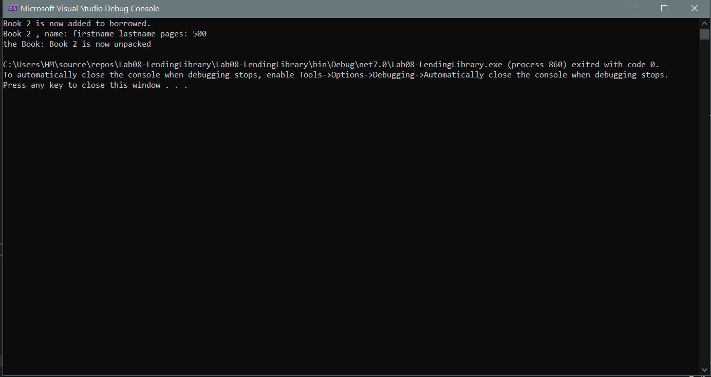

# Lab08-LendingLibrary

this is a simple book lending library application, made using C#.
it allows users to add new books to their collection, manage them, borrow them, create a backpack to pack and unpack them.

### example output (in the console):
here is how the application functions:

this example shows that a book titled "book 2" is added to the borrowed list, the details of the book, including the author's name and the number of pages, are then displayed. After that, it was unpacked.

to use this application:
- clone this repo.
- open it in visual studio.
- Navigate to the main method, where you can interact with the lending library.
- in the main method, you can add a new Book using the Add method from the library class.
- then you can enter books details like book title, first name, last name, and the number of pages.
- and you can use borrow method from the library class, to borrow a book (add book title in the argument).
- you can also use the pack and unpack methods from Backpack class, to add books to the backpack and remove them.

